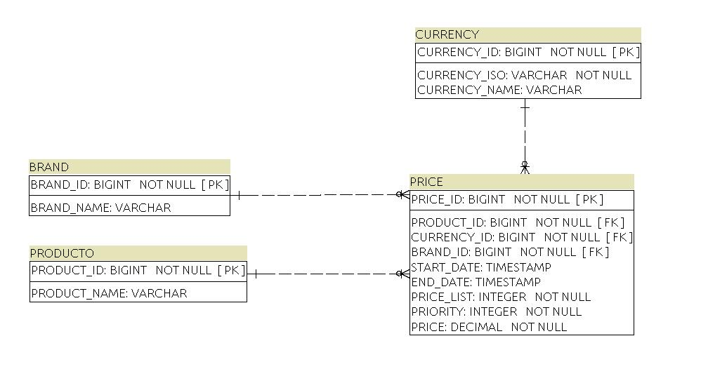

# PRICE CONSULTATION SERVICE


# Stack


# Summary

Este servicio permite consultar el precio de un producto en una fecha determinada. Aca dejo un model ER de la solucion.



# How to use this code?

1. Debe tener instalado [Java 17](https://www.java.com/download/) y [Maven](https://maven.apache.org)

2. Clonar este repositorio

```
$ git clone https://github.com/japarejodiaz/ms-prices-product.git
```

3. Posicionarse en la carpeta

```
$ cd ms-prices-product
```

4. Instalar dependencias

```
$ mvn install
```

5. Ejecutar el proyecto

```
$ mvn spring-boot:run
```

# Interfaces UI

Una vez iniciado el servicio puede acceder las siguientes UI:

### Swagger:
```
http://localhost:8080/swagger-ui/index.html?configUrl=/api-docs/swagger-config#/
```

### H2 console:

```
http://localhost:8080/h2-ui
```
Parametros necesarios

**JDBC-URL:** jdbc:h2:file:./products

**user-name:** sa

# Initial loading of data and tests - data de pruebas

### Prices table:

| PRICE_ID | BRAND_ID | PRODUCT_ID | CURRENCY_ID | START_DATE             | END_DATE               | PRICE_LIST | PRIORITY | PRICE |
|----------|----------|------------|------------|------------------------|------------------------|------------|----------|-------|
| 1        | 1        | 35455      | 2          | '2020-06-14T00:00:00'  | '2020-12-31T23:59:59'  | 1          | 0        | 35.50 |
| 2        | 1        | 35455      | 2          | '2020-06-14T15:00:00'  | '2020-06-14T18:30:00'  | 2          | 1        | 25.45 |
| 3        | 1        | 35455      | 2          | '2020-06-15T00:00:00'  | '2020-06-15T11:00:00'  | 3          | 1        | 30.50 |
| 4        | 1        | 35455      | 2          | '2020-06-15T16:00:00'  | '2020-12-31T23:59:59'  | 4          | 1        | 38.95 |
| 5        | 1        | 35455      | 2          | '2021-01-01T00:00:00'  | '2023-01-15T15:59:59'  | 4          | 1        | 40.95 |
| 6        | 1        | 35455      | 2          | '2023-01-15T16:00:00'  | '2023-12-31T23:59:59'  | 4          | 1        | 45.95 |
| 7        | 2        | 35456      | 2          | '2023-01-01T00:00:00'  | '2023-12-31T00:00:00'  | 2          | 1        | 150.00 |
| 8        | 3        | 35457      | 3          | '2023-01-01T00:00:00'  | '2023-12-31T00:00:00'  | 1          | 2        | 120.00 |

### Test cases:

-          Test 1: petición a las 10:00 del día 14 del producto 35455 para la brand 1 
-          Test 2: petición a las 16:00 del día 14 del producto 35455 para la brand 1 
-          Test 3: petición a las 21:00 del día 14 del producto 35455 para la brand 1 
-          Test 4: petición a las 10:00 del día 15 del producto 35455 para la brand 1 
-          Test 5: petición a las 21:00 del día 16 del producto 35455 para la brand 1 

### Results - resultados de las test
```

```
